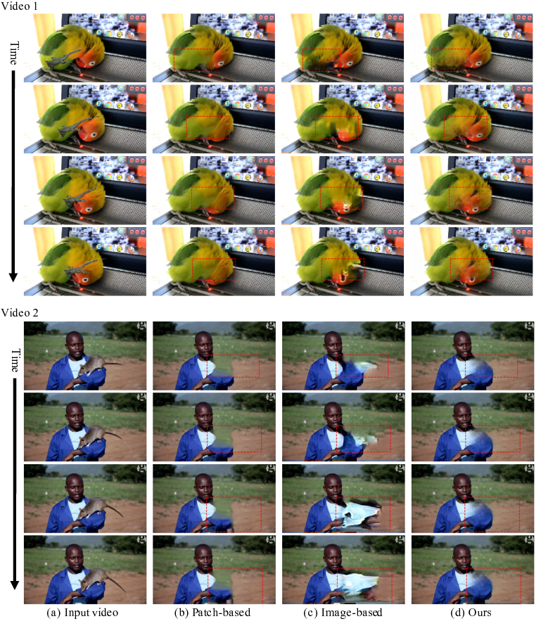

# VORNet: Spatio-temporally Consistent Video Inpainting for Object Removal

Official repo for “VORNet: Spatio-temporally Consistent Video Inpainting for Object Removal, CVPRW 2019” [arxiv](https://arxiv.org/abs/1904.06726)

## SVOR Dataset and Result Videos

Please see the [Google Drive](https://drive.google.com/drive/folders/13amF3QTEcE0IEo26Gc6annMQbKUGVPm0)

## Author
* Ya-Liang Chang [amjltc295](https://github.com/amjltc295)
* Zhe-Yu Liu

Please cite our paper if you find it useful:
@inproceedings{chang2019vornet,
  title={VORNet: Spatio-temporally Consistent Video Inpainting for Object Removal},
  author={Chang, Ya-Liang and Yu Liu, Zhe and Hsu, Winston},
  booktitle={Proceedings of the IEEE Conference on Computer Vision and Pattern Recognition Workshops},
  pages={0--0},
  year={2019}
}
